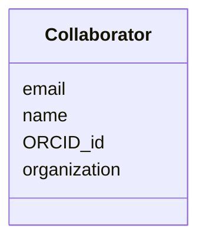

# Class: Collaborator


URI: [bbqs:Collaborator](https://identifiers.org/bbqs/project-metadata-schemaCollaborator)





<!-- no inheritance hierarchy -->


## Slots

| Name | Cardinality and Range | Description | Inheritance |
| ---  | --- | --- | --- |
| [name](name.md) | 0..1 <br/> [String](String.md) |  | direct |
| [email](email.md) | 0..1 <br/> [String](String.md) |  | direct |
| [organization](organization.md) | 0..1 <br/> [String](String.md) |  | direct |
| [ORCID_id](ORCID_id.md) | 0..1 <br/> [String](String.md) |  | direct |


## Identifier and Mapping Information


### Schema Source


* from schema: https://identifiers.org/bbqs/project-metadata-schema


## Mappings

| Mapping Type | Mapped Value |
| ---  | ---  |
| self | bbqs:Collaborator |
| native | bbqs:Collaborator |


## LinkML Source

<!-- TODO: investigate https://stackoverflow.com/questions/37606292/how-to-create-tabbed-code-blocks-in-mkdocs-or-sphinx -->

### Direct

<details>
```yaml
name: Collaborator
from_schema: https://identifiers.org/bbqs/project-metadata-schema
attributes:
  name:
    name: name
    from_schema: https://identifiers.org/bbqs/project-metadata-schema
    rank: 1000
    domain_of:
    - Collaborator
    - Species
  email:
    name: email
    from_schema: https://identifiers.org/bbqs/project-metadata-schema
    rank: 1000
    domain_of:
    - Collaborator
  organization:
    name: organization
    from_schema: https://identifiers.org/bbqs/project-metadata-schema
    rank: 1000
    domain_of:
    - Collaborator
  ORCID_id:
    name: ORCID_id
    from_schema: https://identifiers.org/bbqs/project-metadata-schema
    rank: 1000
    domain_of:
    - Collaborator

```
</details>

### Induced

<details>
```yaml
name: Collaborator
from_schema: https://identifiers.org/bbqs/project-metadata-schema
attributes:
  name:
    name: name
    from_schema: https://identifiers.org/bbqs/project-metadata-schema
    rank: 1000
    alias: name
    owner: Collaborator
    domain_of:
    - Collaborator
    - Species
    range: string
  email:
    name: email
    from_schema: https://identifiers.org/bbqs/project-metadata-schema
    rank: 1000
    alias: email
    owner: Collaborator
    domain_of:
    - Collaborator
    range: string
  organization:
    name: organization
    from_schema: https://identifiers.org/bbqs/project-metadata-schema
    rank: 1000
    alias: organization
    owner: Collaborator
    domain_of:
    - Collaborator
    range: string
  ORCID_id:
    name: ORCID_id
    from_schema: https://identifiers.org/bbqs/project-metadata-schema
    rank: 1000
    alias: ORCID_id
    owner: Collaborator
    domain_of:
    - Collaborator
    range: string

```
</details>