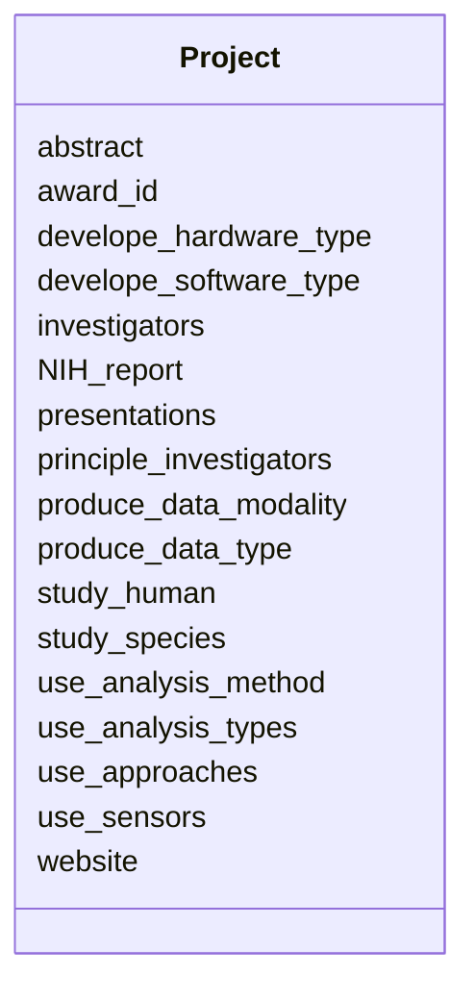

# Class: Project


URI: [bbqs:Project](https://identifiers.org/bbqs/project-metadata-schemaProject)





<!-- no inheritance hierarchy -->


## Slots

| Name | Cardinality and Range | Description | Inheritance |
| ---  | --- | --- | --- |
| [award_id](award_id.md) | 0..1 <br/> [String](String.md) | award number, can be used as id | direct |
| [principle_investigators](principle_investigators.md) | * <br/> [String](String.md) |  | direct |
| [investigators](investigators.md) | * <br/> [String](String.md) |  | direct |
| [presentations](presentations.md) | * <br/> [String](String.md) |  | direct |
| [abstract](abstract.md) | 0..1 <br/> [String](String.md) |  | direct |
| [website](website.md) | 0..1 <br/> [String](String.md) |  | direct |
| [NIH_report](NIH_report.md) | 0..1 <br/> [String](String.md) |  | direct |
| [study_human](study_human.md) | 0..1 <br/> [String](String.md) |  | direct |
| [study_species](study_species.md) | 0..1 <br/> [String](String.md) |  | direct |
| [use_sensors](use_sensors.md) | * <br/> [String](String.md) |  | direct |
| [use_approaches](use_approaches.md) | 0..1 <br/> [String](String.md) |  | direct |
| [produce_data_modality](produce_data_modality.md) | * <br/> [String](String.md) |  | direct |
| [produce_data_type](produce_data_type.md) | * <br/> [String](String.md) |  | direct |
| [develope_hardware_type](develope_hardware_type.md) | * <br/> [String](String.md) |  | direct |
| [develope_software_type](develope_software_type.md) | * <br/> [String](String.md) |  | direct |
| [use_analysis_method](use_analysis_method.md) | * <br/> [String](String.md) | statistical or computational methods do you primarily rely on for your data a... | direct |
| [use_analysis_types](use_analysis_types.md) | * <br/> [String](String.md) | types of analyses are you performing on your neural and behavioral data | direct |


## Identifier and Mapping Information


### Schema Source


* from schema: https://identifiers.org/bbqs/project-metadata-schema


## Mappings

| Mapping Type | Mapped Value |
| ---  | ---  |
| self | bbqs:Project |
| native | bbqs:Project |


## LinkML Source

<!-- TODO: investigate https://stackoverflow.com/questions/37606292/how-to-create-tabbed-code-blocks-in-mkdocs-or-sphinx -->

### Direct

<details>
```yaml
name: Project
from_schema: https://identifiers.org/bbqs/project-metadata-schema
attributes:
  award_id:
    name: award_id
    description: award number, can be used as id
    from_schema: https://identifiers.org/bbqs/project-metadata-schema
    rank: 1000
    domain_of:
    - Project
  principle_investigators:
    name: principle_investigators
    from_schema: https://identifiers.org/bbqs/project-metadata-schema
    rank: 1000
    domain_of:
    - Project
    multivalued: true
  investigators:
    name: investigators
    from_schema: https://identifiers.org/bbqs/project-metadata-schema
    rank: 1000
    domain_of:
    - Project
    multivalued: true
  presentations:
    name: presentations
    from_schema: https://identifiers.org/bbqs/project-metadata-schema
    rank: 1000
    domain_of:
    - Project
    multivalued: true
  abstract:
    name: abstract
    from_schema: https://identifiers.org/bbqs/project-metadata-schema
    rank: 1000
    domain_of:
    - Project
  website:
    name: website
    from_schema: https://identifiers.org/bbqs/project-metadata-schema
    rank: 1000
    domain_of:
    - Project
  NIH_report:
    name: NIH_report
    from_schema: https://identifiers.org/bbqs/project-metadata-schema
    rank: 1000
    domain_of:
    - Project
  study_human:
    name: study_human
    from_schema: https://identifiers.org/bbqs/project-metadata-schema
    rank: 1000
    domain_of:
    - Project
  study_species:
    name: study_species
    from_schema: https://identifiers.org/bbqs/project-metadata-schema
    rank: 1000
    domain_of:
    - Project
  use_sensors:
    name: use_sensors
    from_schema: https://identifiers.org/bbqs/project-metadata-schema
    rank: 1000
    domain_of:
    - Project
    multivalued: true
  use_approaches:
    name: use_approaches
    from_schema: https://identifiers.org/bbqs/project-metadata-schema
    rank: 1000
    domain_of:
    - Project
  produce_data_modality:
    name: produce_data_modality
    from_schema: https://identifiers.org/bbqs/project-metadata-schema
    rank: 1000
    domain_of:
    - Project
    multivalued: true
  produce_data_type:
    name: produce_data_type
    from_schema: https://identifiers.org/bbqs/project-metadata-schema
    rank: 1000
    domain_of:
    - Project
    multivalued: true
  develope_hardware_type:
    name: develope_hardware_type
    from_schema: https://identifiers.org/bbqs/project-metadata-schema
    rank: 1000
    domain_of:
    - Project
    multivalued: true
  develope_software_type:
    name: develope_software_type
    from_schema: https://identifiers.org/bbqs/project-metadata-schema
    rank: 1000
    domain_of:
    - Project
    multivalued: true
  use_analysis_method:
    name: use_analysis_method
    description: statistical or computational methods do you primarily rely on for
      your data analysis
    from_schema: https://identifiers.org/bbqs/project-metadata-schema
    rank: 1000
    domain_of:
    - Project
    multivalued: true
  use_analysis_types:
    name: use_analysis_types
    description: types of analyses are you performing on your neural and behavioral
      data
    from_schema: https://identifiers.org/bbqs/project-metadata-schema
    rank: 1000
    domain_of:
    - Project
    multivalued: true

```
</details>

### Induced

<details>
```yaml
name: Project
from_schema: https://identifiers.org/bbqs/project-metadata-schema
attributes:
  award_id:
    name: award_id
    description: award number, can be used as id
    from_schema: https://identifiers.org/bbqs/project-metadata-schema
    rank: 1000
    alias: award_id
    owner: Project
    domain_of:
    - Project
    range: string
  principle_investigators:
    name: principle_investigators
    from_schema: https://identifiers.org/bbqs/project-metadata-schema
    rank: 1000
    alias: principle_investigators
    owner: Project
    domain_of:
    - Project
    range: string
    multivalued: true
  investigators:
    name: investigators
    from_schema: https://identifiers.org/bbqs/project-metadata-schema
    rank: 1000
    alias: investigators
    owner: Project
    domain_of:
    - Project
    range: string
    multivalued: true
  presentations:
    name: presentations
    from_schema: https://identifiers.org/bbqs/project-metadata-schema
    rank: 1000
    alias: presentations
    owner: Project
    domain_of:
    - Project
    range: string
    multivalued: true
  abstract:
    name: abstract
    from_schema: https://identifiers.org/bbqs/project-metadata-schema
    rank: 1000
    alias: abstract
    owner: Project
    domain_of:
    - Project
    range: string
  website:
    name: website
    from_schema: https://identifiers.org/bbqs/project-metadata-schema
    rank: 1000
    alias: website
    owner: Project
    domain_of:
    - Project
    range: string
  NIH_report:
    name: NIH_report
    from_schema: https://identifiers.org/bbqs/project-metadata-schema
    rank: 1000
    alias: NIH_report
    owner: Project
    domain_of:
    - Project
    range: string
  study_human:
    name: study_human
    from_schema: https://identifiers.org/bbqs/project-metadata-schema
    rank: 1000
    alias: study_human
    owner: Project
    domain_of:
    - Project
    range: string
  study_species:
    name: study_species
    from_schema: https://identifiers.org/bbqs/project-metadata-schema
    rank: 1000
    alias: study_species
    owner: Project
    domain_of:
    - Project
    range: string
  use_sensors:
    name: use_sensors
    from_schema: https://identifiers.org/bbqs/project-metadata-schema
    rank: 1000
    alias: use_sensors
    owner: Project
    domain_of:
    - Project
    range: string
    multivalued: true
  use_approaches:
    name: use_approaches
    from_schema: https://identifiers.org/bbqs/project-metadata-schema
    rank: 1000
    alias: use_approaches
    owner: Project
    domain_of:
    - Project
    range: string
  produce_data_modality:
    name: produce_data_modality
    from_schema: https://identifiers.org/bbqs/project-metadata-schema
    rank: 1000
    alias: produce_data_modality
    owner: Project
    domain_of:
    - Project
    range: string
    multivalued: true
  produce_data_type:
    name: produce_data_type
    from_schema: https://identifiers.org/bbqs/project-metadata-schema
    rank: 1000
    alias: produce_data_type
    owner: Project
    domain_of:
    - Project
    range: string
    multivalued: true
  develope_hardware_type:
    name: develope_hardware_type
    from_schema: https://identifiers.org/bbqs/project-metadata-schema
    rank: 1000
    alias: develope_hardware_type
    owner: Project
    domain_of:
    - Project
    range: string
    multivalued: true
  develope_software_type:
    name: develope_software_type
    from_schema: https://identifiers.org/bbqs/project-metadata-schema
    rank: 1000
    alias: develope_software_type
    owner: Project
    domain_of:
    - Project
    range: string
    multivalued: true
  use_analysis_method:
    name: use_analysis_method
    description: statistical or computational methods do you primarily rely on for
      your data analysis
    from_schema: https://identifiers.org/bbqs/project-metadata-schema
    rank: 1000
    alias: use_analysis_method
    owner: Project
    domain_of:
    - Project
    range: string
    multivalued: true
  use_analysis_types:
    name: use_analysis_types
    description: types of analyses are you performing on your neural and behavioral
      data
    from_schema: https://identifiers.org/bbqs/project-metadata-schema
    rank: 1000
    alias: use_analysis_types
    owner: Project
    domain_of:
    - Project
    range: string
    multivalued: true

```
</details>