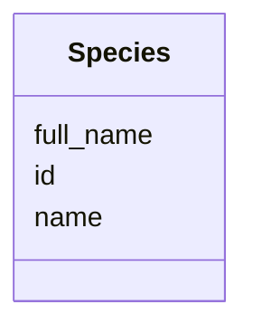

# Class: Species


URI: [bbqs:Species](https://identifiers.org/bbqs/project-metadata-schemaSpecies)





<!-- no inheritance hierarchy -->


## Slots

| Name | Cardinality and Range | Description | Inheritance |
| ---  | --- | --- | --- |
| [id](id.md) | 0..1 <br/> [String](String.md) |  | direct |
| [name](name.md) | 0..1 <br/> [String](String.md) | human readable | direct |
| [full_name](full_name.md) | 0..1 <br/> [String](String.md) | full name | direct |


## Identifier and Mapping Information


### Schema Source


* from schema: https://identifiers.org/bbqs/project-metadata-schema


## Mappings

| Mapping Type | Mapped Value |
| ---  | ---  |
| self | bbqs:Species |
| native | bbqs:Species |


## LinkML Source

<!-- TODO: investigate https://stackoverflow.com/questions/37606292/how-to-create-tabbed-code-blocks-in-mkdocs-or-sphinx -->

### Direct

<details>
```yaml
name: Species
from_schema: https://identifiers.org/bbqs/project-metadata-schema
attributes:
  id:
    name: id
    from_schema: https://identifiers.org/bbqs/project-metadata-schema
    rank: 1000
    domain_of:
    - Species
    - Abstract
  name:
    name: name
    description: human readable
    from_schema: https://identifiers.org/bbqs/project-metadata-schema
    domain_of:
    - Collaborator
    - Species
  full_name:
    name: full_name
    description: full name
    from_schema: https://identifiers.org/bbqs/project-metadata-schema
    rank: 1000
    domain_of:
    - Species

```
</details>

### Induced

<details>
```yaml
name: Species
from_schema: https://identifiers.org/bbqs/project-metadata-schema
attributes:
  id:
    name: id
    from_schema: https://identifiers.org/bbqs/project-metadata-schema
    rank: 1000
    alias: id
    owner: Species
    domain_of:
    - Species
    - Abstract
    range: string
  name:
    name: name
    description: human readable
    from_schema: https://identifiers.org/bbqs/project-metadata-schema
    alias: name
    owner: Species
    domain_of:
    - Collaborator
    - Species
    range: string
  full_name:
    name: full_name
    description: full name
    from_schema: https://identifiers.org/bbqs/project-metadata-schema
    rank: 1000
    alias: full_name
    owner: Species
    domain_of:
    - Species
    range: string

```
</details>