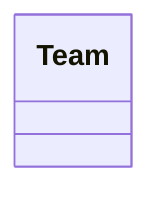

# Class: Team


URI: [bbqs:Team](https://identifiers.org/bbqs/project-metadata-schemaTeam)





<!-- no inheritance hierarchy -->


## Slots

| Name | Cardinality and Range | Description | Inheritance |
| ---  | --- | --- | --- |


## Identifier and Mapping Information


### Schema Source


* from schema: https://identifiers.org/bbqs/project-metadata-schema


## Mappings

| Mapping Type | Mapped Value |
| ---  | ---  |
| self | bbqs:Team |
| native | bbqs:Team |


## LinkML Source

<!-- TODO: investigate https://stackoverflow.com/questions/37606292/how-to-create-tabbed-code-blocks-in-mkdocs-or-sphinx -->

### Direct

<details>
```yaml
name: Team
from_schema: https://identifiers.org/bbqs/project-metadata-schema

```
</details>

### Induced

<details>
```yaml
name: Team
from_schema: https://identifiers.org/bbqs/project-metadata-schema

```
</details>